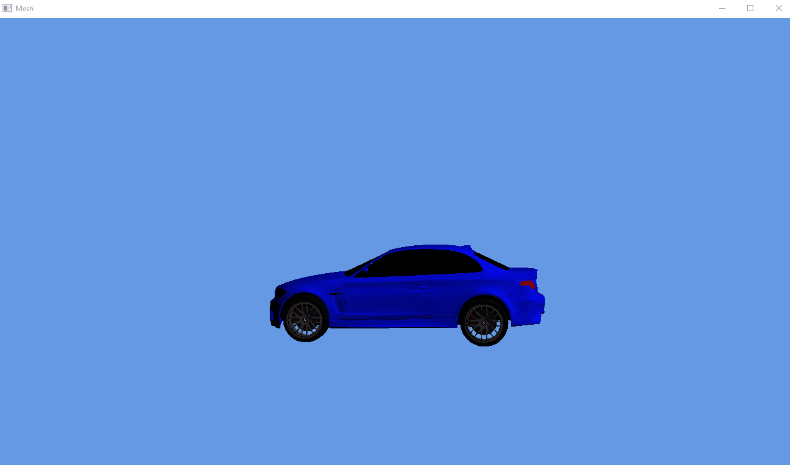

# D3D12 Sample

The Sample Code While learning DirectX12. It's a simple forward shading, phong lighting model using [BMW model from Casual Effect](https://casual-effects.com/g3d/data10/research/model/bmw/bmw.zip).

## Dependencies
- SDL2, I used the Binaries from Vulkan SDK, remember to add `VulkanSDK` path to `CMAKE_PREFIX_PATH` in order to find it.
- glm, using left handed coordinate system to cop with D3D12.
- tinyobjloader.

## Screen Shots

## Thanks
- [Gep's excellent tutorial and sample code](https://www.3dgep.com/learning-directx-12-2/)
- [Alain Galvan's Dx12seed](https://alain.xyz/blog/raw-directx12)
- [Lotwig D3D12 Videos](https://www.youtube.com/watch?v=sH90ulKE1f8)

